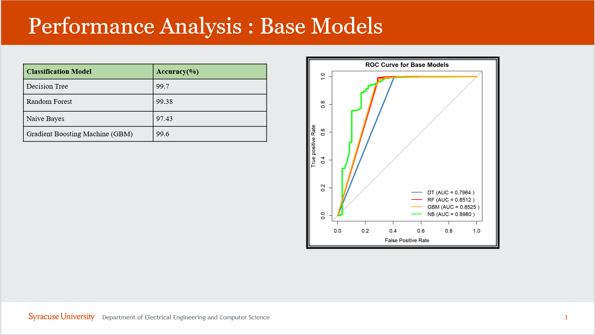

# Covid-Prediction

The goal of this study is to predict the health status of Covid- 19 individual, to be critical or stable based on demographic
data and health history of that Individual. We will also analyze what are the most relevant features to predict if a
patient infected with Covid-19, will be in stable or critical condition? Can we find the best combination of features to
reach a high level of accuracy? We will also investigate which Machine Learning Algorithm will produce better
accuracy?

  

